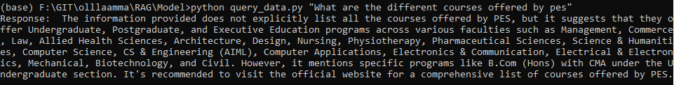
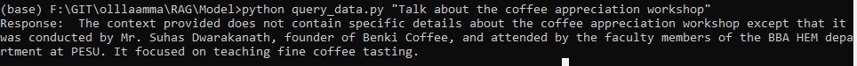
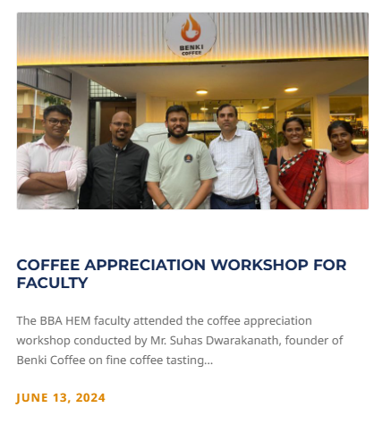
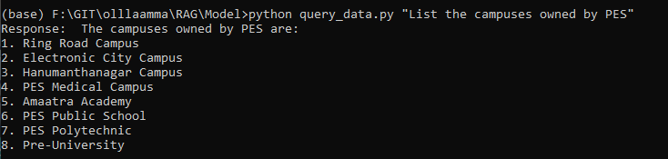
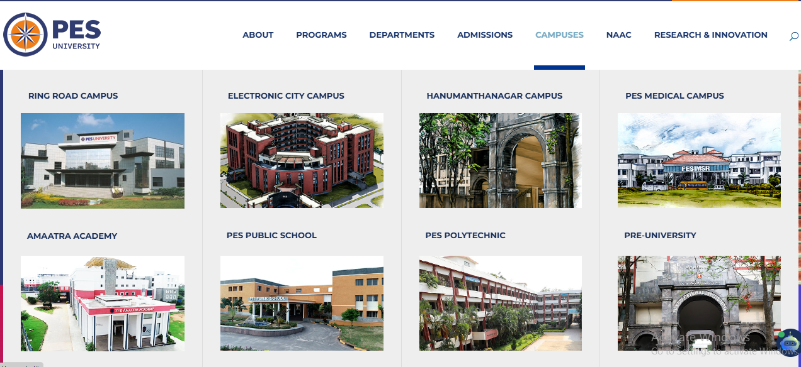

# Talk to Website
This project aims to develop a system capable of answering questions based on the content extracted from a website.

## Project Overview
The project consists of several key components:

### Web Crawler:

* A crawler that explores a specified base website and other pages within its domain.
* Returns the crawled HTML content in JSON format.
* TypeScript based crawler which uses Playwright to crawl website.

### Content Extractor:

* Cleans the HTML by removing unnecessary tags such as headers, footers, and navbars.
* Divides the cleaned HTML into chunks based on semantic similarity.
* Utilizes the CosineStrategy based on cosine similarity to group related content chunks and then converts these grouped html chunks into markdown format for better readability for the llm.

### Database Population:

* Converts the content chunks into vectors.
* Stores these vectors in a vector database (Chroma DB).

### Query Data:

* Allows users to input queries.
* Retrieves relevant content from the database based on the query.
* Utilizes a Language Model (LM), specifically Mistral, to generate answers based on the retrieved context.


## Installion and Running

### Crawl4Ai
1. I Used this package for grouping related chunks together
2. To Install this Package cd into the crawl4ai folder and run
 ```bash
   pip install -r requirements.txt
   python setup.py build
   python setup.py install
   ```

### Ollama
1. Install the Local Ollama from [Ollama](https://ollama.com/).
2. Pull embedding nomic-embed-text
  ```bash
  ollama pull nomic-embed-text
  ```
3. Pull Mistral LLM Model
  ```bash
  ollama pull mistral
  ```

### Crawler
1. cd into the crawler folder
2. Install node modules
  ```bash
  npm i
  ```
3. Start Server
 ```bash
  npm run start:server
  ```
### Database
1. cd into the database folder
2. install the python libraries
 ```bash
  pip install -r requirements.txt
  ```
3. Start Server
 ```bash
  python app.py
  ```

### Main
1. cd into the main folder
2. Start Server
 ```bash
  python app.py
  ```
## Functionalities

The Main Server runs on localhost:3001 and constists of two api endpoints `/crawl` and `/query`
1. `/crawl` : This endpoint is a get request and takes in a website url as a parameter. This url is used to crawl the given website and store it into the chroma database.

   EX: `http://localhost:3001/crawl?website=https://pes.edu/`
2. `/query` : This endpoint is a get request and takes in a user query as a parameter and is used to ask questions regarding the website.

   EX: `http://localhost:3001/query?query="What are the courses offered by pes"`

### PS
Since, I dont have access to a good GPU [Iam running the models on an I7 Laptop with no GPU]

1. I Couldnt test this application on the entire domain of pes.edu, so I restricted the amount of crawled webpages to 5
2. I Couldnt submit the Github Repo on time since, the mistral model took forever to generate the results [I Tried Few small scale LLM Models but none could provide me any satisfying results]

Again Keeping in mind that I dont have a gpu to work with These are the results I Got:

RESULT IMAGE 1:


RESULT IMAGE 2:



SOURCE FOR IMAGE 2:



RESULT IMAGE 3:



SOURCE FOR IMAGE 3:


